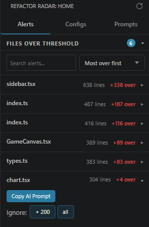
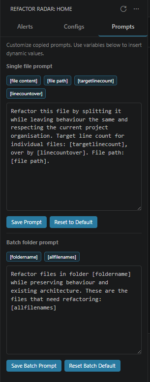
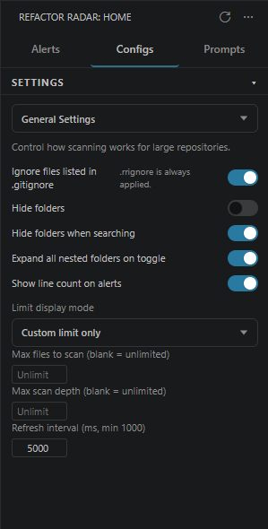

# Refactor Radar

Monitor file lengths and generate AI refactor prompts without leaving VS Code.

  
  
  

## Features

- **Status bar line count** - see your current file size at a glance
- **AI prompt generation** - copies a refactor prompt with full file content to your clipboard
- **Configurable thresholds** - set limits per file type and ignore specific languages
- **Activity Bar panel** - quick access to extension features and settings

## Usage

1. Open any code file in VS Code
2. Watch the line count in the status bar
3. When a file exceeds the threshold, use the notification or command palette to copy an AI refactor prompt
4. Paste into your preferred AI tool and start refactoring

## Other ways to install

To install from source, see the [GitHub repository](https://github.com/Enovinx/refactor-radar).